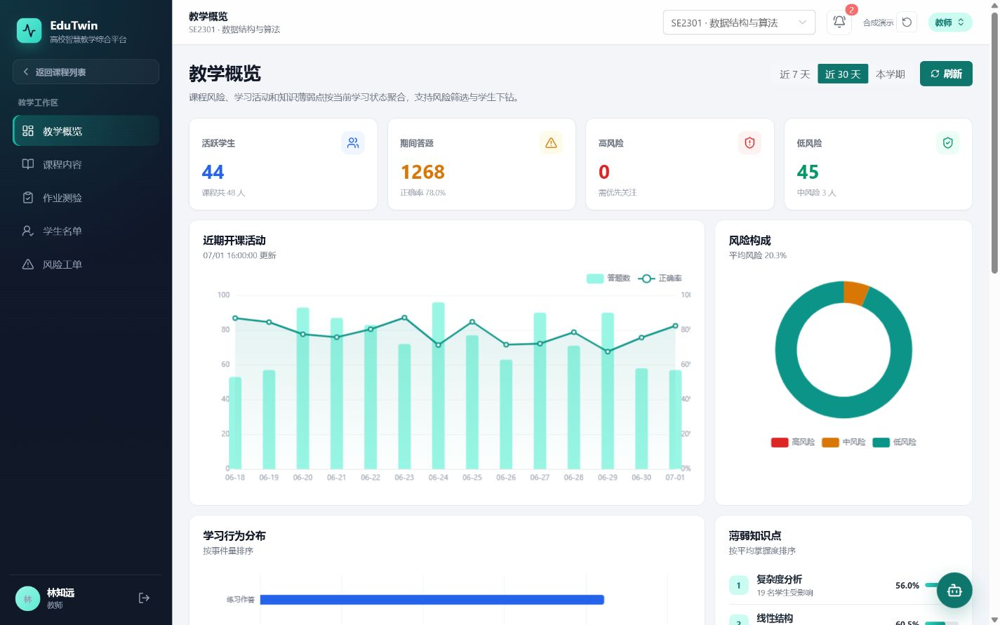
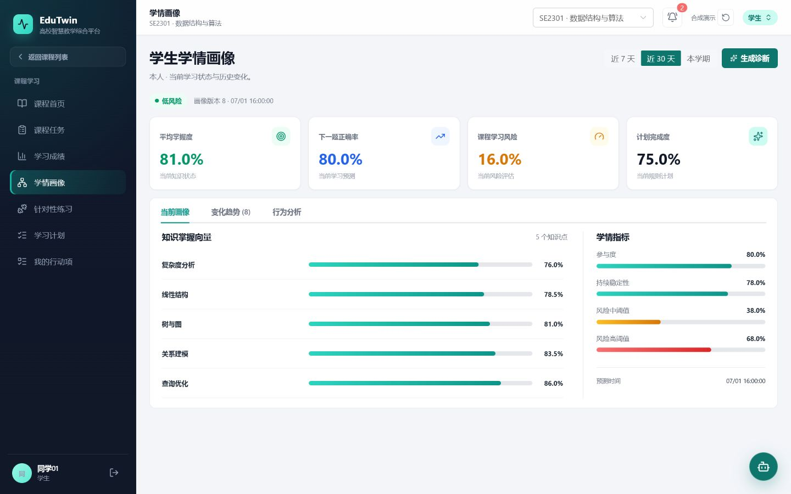
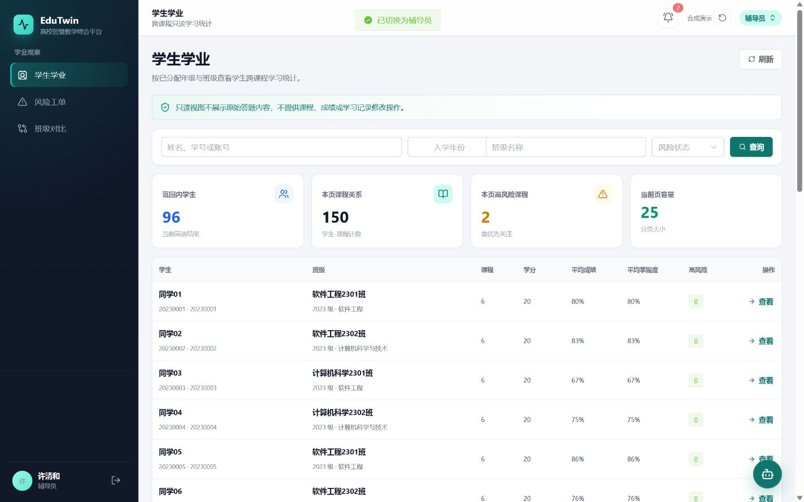
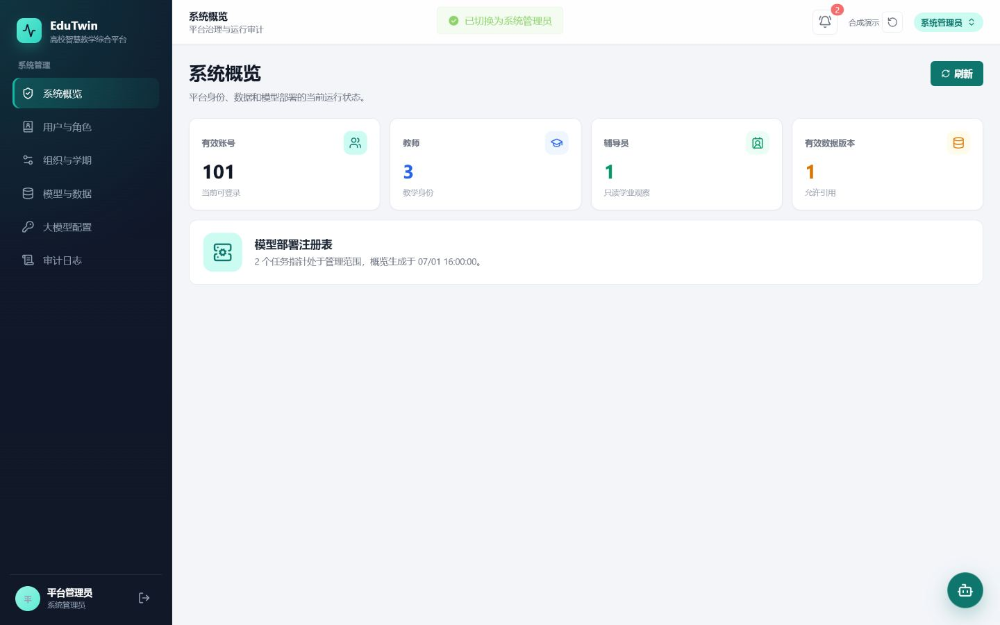
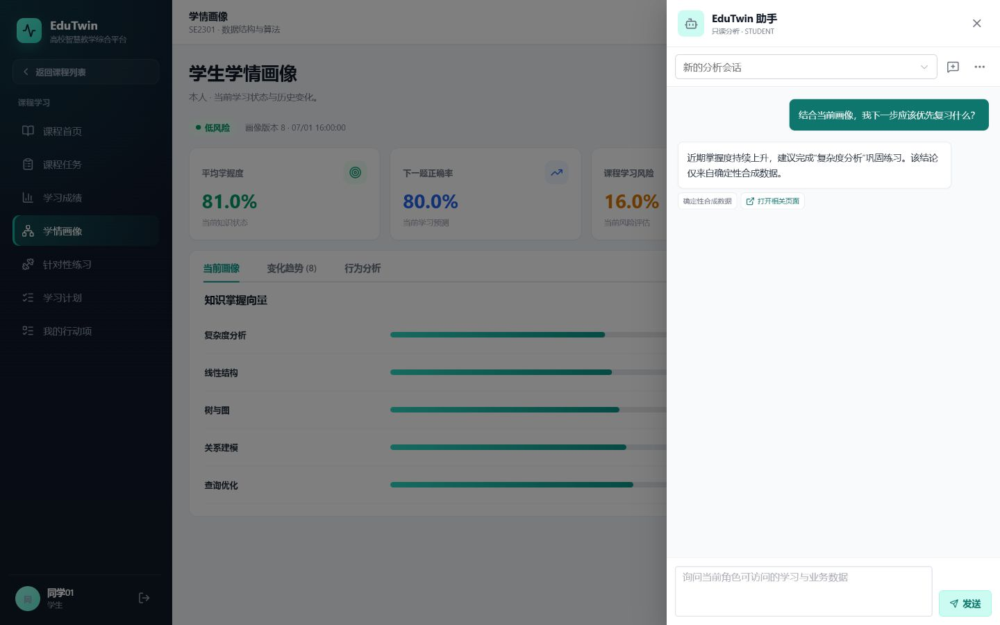
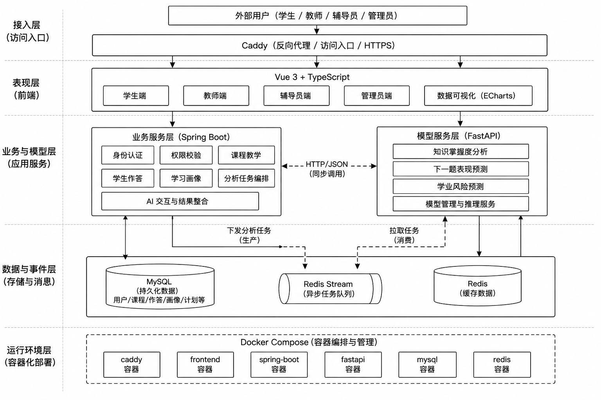

# EduTwin

English | [中文](./README.md)

[](https://github.com/galaxywk223/edutwin/actions/workflows/ci.yml)
[](https://galaxywk223.github.io/edutwin/)
[](./LICENSE)

EduTwin is a learning analytics and digital learning profile platform for higher education. It connects course activity, answer events, knowledge tracing, risk prediction, and learning plans through a traceable asynchronous workflow, with dedicated workspaces for students, teachers, counselors, and administrators.



## Live Demo

The GitHub Pages demo runs entirely in the browser with deterministic synthetic data. It requires no account, backend, API key, or restricted dataset.

- [Open the interactive EduTwin demo](https://galaxywk223.github.io/edutwin/)
- Enter as a student, teacher, counselor, or administrator from the login screen.
- Practice submissions, plans, risk feedback, and assistant messages update local demo state.

## Product Workflows

| Role | Workflows |
| --- | --- |
| Student | Courses, assessments, targeted practice, learning profile, plan, and risk actions |
| Teacher | Course content, assessments, roster, analytics, student profiles, and intervention cases |
| Counselor | Authorized student analytics, class comparison, and cross-course intervention tracking |
| Administrator | Users, organizations, data/model versions, AI configuration, and audit governance |

### Role Workspaces

| Student learning profile | Teacher analytics |
| --- | --- |
|  |  |
| Counselor academic overview | System administration |
|  |  |

The assistant returns template-based diagnostics within the active role's read-only data boundary and labels the synthetic source explicitly.



```text
Learning activity and answers
  -> transactional Answer / Analysis Job / Outbox records
  -> asynchronous analysis over Redis Stream
  -> mastery, next-correct probability, and course risk
  -> immutable learning profile, rule-based plan, and structured diagnosis
  -> SSE updates for student and teacher views
```

## Architecture



| Module | Technology and responsibility |
| --- | --- |
| `frontend` | Vue 3, TypeScript, Vite, Element Plus, and ECharts |
| `backend` | Java 21, Spring Boot, Spring Security, Flyway, and Outbox |
| `modeling` | FastAPI, PyTorch, scikit-learn, LightGBM, CatBoost, and SHAP |
| `contracts` | OpenAPI 3.1 and AsyncAPI contracts |
| `infra` | Docker Compose, Caddy, backup, rollback, and release tooling |
| `data` | Source licenses, hashes, synthetic demo data, and reproduction configs |

## Quick Start

### Browser Showcase

```powershell
Set-Location frontend
npm ci
npm run dev:showcase
```

The development server runs at `http://localhost:5173/`.

### Compact Full Stack

Docker Desktop or Docker Engine 24+ is the only prerequisite. The showcase stack does not download ASSISTments/OULAD, load trained model binaries, or call an external LLM.

```powershell
docker compose -f infra/compose/showcase.yaml up --build --wait
```

The application runs at `http://localhost:8080/`.

## Test Evidence

Every pull request validates frontend types and interactions, Spring business tests, Python modeling tests, OpenAPI/AsyncAPI contracts, both Compose profiles, and the complete reachable Git history. Pages has a dedicated deterministic-data and browser-build path. Full dataset training, performance tests, and server acceptance remain manual workflows.

## Data and Model Boundaries

- Showcase data is generated from a fixed seed and contains no real student, institution, or course record.
- ASSISTments 2009-2010 uses non-standard research terms. Raw files and student-level records never enter Git, images, releases, or the public demo.
- OULAD is licensed under CC BY 4.0. Attribution and pinned sources are documented in [Data Sources and Licenses](./docs/data/sources-and-licenses.md).
- The research workflow retains IRT, BKT, DKT, AKT, Logistic Regression, LightGBM, CatBoost, and SHAP pipelines without making them a demo prerequisite.
- AI integration is disabled by default. Rule-based inference and template diagnosis keep the workflow available without an API key.

## Development

Frontend, backend, modeling, contract, and security commands are listed in the [Chinese README](./README.md#开发与验证). The complete documentation map is available in [docs/README.md](./docs/README.md).

## Contributing and License

Contribution guidance is available in [CONTRIBUTING.md](./CONTRIBUTING.md), and security reporting is defined in [SECURITY.md](./SECURITY.md). Source code is licensed under the [Apache License 2.0](./LICENSE). Dataset-specific terms remain independent and are summarized in [NOTICE](./NOTICE).
