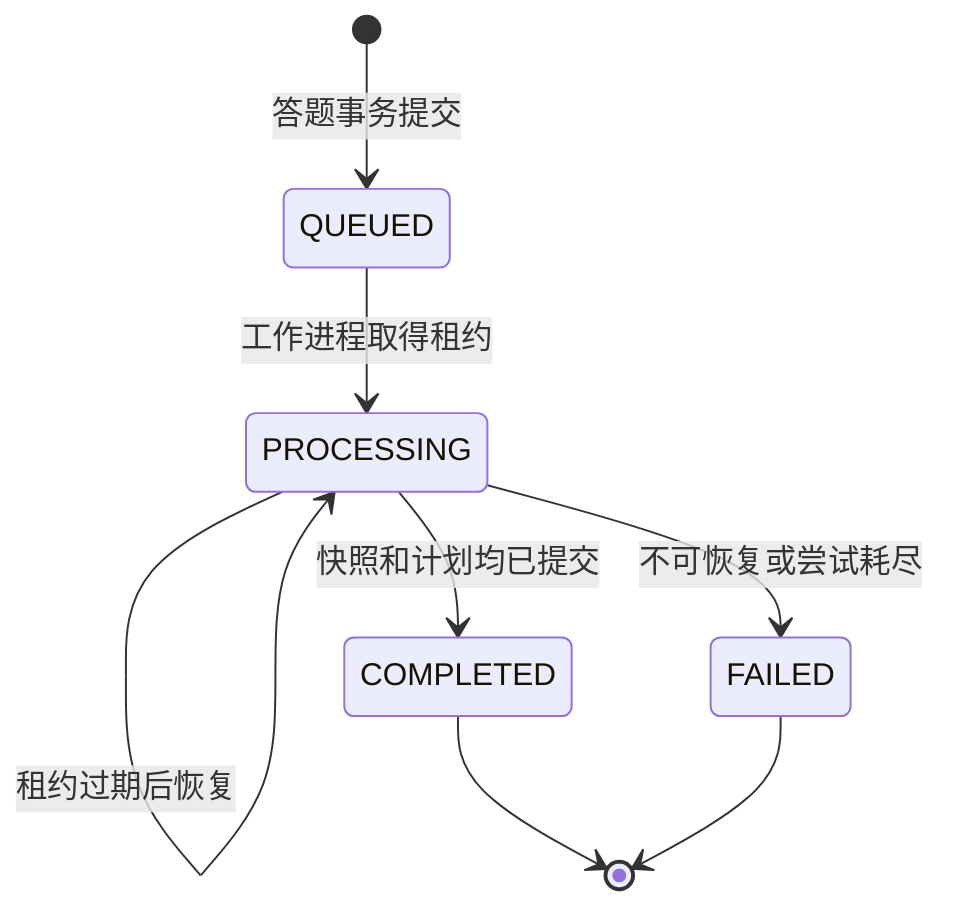

# 分析事件语义

## 适用范围

本文档冻结答题提交至教师驾驶舱刷新的事务、事件、任务、重试、恢复、SSE 和缓存语义。公共接口、AsyncAPI、Flyway 迁移、后端实现和验收测试必须使用相同语义。

主链路如下：

```text
answer_event
  -> outbox_event
  -> Redis Stream analysis-events
  -> analysis_job
  -> mastery/risk predictions
  -> immutable twin_snapshot
  -> versioned learning_plan
  -> persisted SSE progress
  -> derived teacher dashboard cache
```

MySQL 是所有业务事实、任务状态、事件进度和版本关系的唯一事实来源。Redis Stream、Redis 缓存和进程内状态均为可丢失、可重建的派生状态。

## 固定标识

| 标识 | 语义 | 稳定性 |
| --- | --- | --- |
| `answerEventId` | 一次去重后的答题事实 | 创建后不变 |
| `answerEventVersion` | 答题模式版本，初始为 `1` | 创建后不变 |
| `analysisJobId` | 答题提交返回的分析任务 | 创建后不变 |
| `analysisJobVersion` | 任务每次持久转换后的乐观锁版本 | 严格递增 |
| `eventId` | 一条生命周期事实及其消费去重键 | 重投时不变 |
| `eventVersion` | 事件载荷模式版本 | 当前固定为 `1` |
| `correlationId` | 一次答题及完整分析链路的关联标识 | 全链路不变 |
| `causationId` | 直接前驱的 `eventId`；首事件使用 `answerEventId` | 创建后不变 |
| `snapshotId` | 一条不可变孪生快照 | 创建后不变 |
| `snapshotVersion` | 学生课程维度的快照版本 | 严格递增 |
| `learningPlanId` | 一版学习计划 | 创建后不变 |
| `learningPlanVersion` | 学生课程维度的计划版本 | 严格递增 |
| `dataVersionIds` | ASSISTments、OULAD 和融合数据版本 | 事件创建后不变 |
| `modelVersionIds` | BKT、下一题、风险、解释、规划和诊断实现版本 | 事件创建后不变 |

事件包络以 [analysis-events.yaml](../../contracts/asyncapi/analysis-events.yaml) 为规范来源。Redis Stream 条目只保存可索引的 `event_id`、`event_type`、`event_version`、`published_at`、`delivery_attempt` 和完整 JSON `payload`，不得拆分并重新解释业务载荷。`aggregateId` 必须等于 `analysisJobId`，`aggregateVersion` 必须等于 `analysisJobVersion`。

## 七类事件

| 顺序 | 事件类型 | 触发条件 | 持久结果 |
| --- | --- | --- | --- |
| 1 | `analysis.requested.v1` | 答题、任务和 Outbox 在同一事务中提交 | `answer_event`、`analysis_job=QUEUED`、进度序号、Outbox |
| 2 | `analysis.started.v1` | 工作进程取得或恢复任务租约 | `analysis_job=PROCESSING`、处理次数、租约、进度序号、Outbox |
| 3 | `predictions.computed.v1` | 模型结果或规则降级结果完成持久化 | 掌握度、下一题概率、风险和解释证据的版本化结果 |
| 4 | `twin.snapshot-created.v1` | 预测结果被原子应用到学生课程状态 | 新快照、当前指针、已应用答题序号、进度序号、Outbox |
| 5 | `learning-plan.created.v1` | 规则引擎生成计划事实，诊断文本已生成或降级 | 新计划、计划项、诊断、证据、当前计划指针、进度序号、Outbox |
| 6 | `analysis.completed.v1` | 所有必需事实均可由标识回读 | `analysis_job=COMPLETED`、降级信息、终止进度序号、Outbox |
| 7 | `analysis.failed.v1` | 不可恢复错误或基础设施处理尝试耗尽 | `analysis_job=FAILED`、结构化错误、终止进度序号、Outbox |

教师驾驶舱更新不是独立业务事实事件。`analysis.completed.v1` 提交后触发课程风险缓存失效或重算；统计结果始终可从 MySQL 当前指针和快照事实重新计算。

## AnalysisJob 状态机

固定状态仅包括 `QUEUED`、`PROCESSING`、`COMPLETED` 和 `FAILED`。



状态约束如下：

- `QUEUED -> PROCESSING -> COMPLETED|FAILED` 是唯一终止路径。
- `PROCESSING -> PROCESSING` 仅表示租约恢复；该转换递增 `processing_attempt` 和任务版本，不引入额外状态。
- FastAPI 故障使用规则掌握度、下一题概率、风险和解释证据完成任务。
- 活动大模型故障使用同结构模板诊断完成任务。
- 降级成功保持 `COMPLETED`，并设置 `degraded=true` 和非空 `degradedStages`。
- `COMPLETED` 和 `FAILED` 是终止状态。终止状态禁止回退、重新计算或覆盖；模型回滚后的重新分析必须创建新任务并保留原任务。
- `FAILED` 仅用于数据库约束错误、顺序无法恢复、任务输入缺失或基础设施尝试耗尽。模型服务和大模型的预期故障不得直接产生 `FAILED`。

## 事务边界

### T1：答题接收事务

Spring Security 在事务开始前完成身份认证，并在事务内根据当前课程关系再次校验授权：学生仅能提交本人答题，教师接口仅能访问所授课程。

答题事务执行以下原子操作：

1. 锁定学生课程序号行并分配单调递增的 `answer_sequence`。
2. 以 `(principal_id, endpoint, idempotency_key_hash)` 查询或插入幂等记录。
3. 插入一条 `answer_event` 及一至多条 `answer_event_knowledge_component`。
4. 插入一条状态为 `QUEUED` 的 `analysis_job`。
5. 插入序号为 `1` 的 `analysis_job_event`。
6. 插入 `analysis.requested.v1` 对应的 `outbox_event`。
7. 保存固定的 `202` 响应状态、响应摘要和 `AnalysisJob` 标识后提交。

事务提交后立即返回 `202 Accepted`。接口不得等待 Redis、FastAPI 或活动大模型。Redis 不可用不回滚已经提交的答题事实。

### T2：Outbox 发布

Outbox relay 使用短事务租用 `PENDING` 行，随后执行 `XADD analysis-events * ...`，最后在新事务中记录 Redis entry ID 和 `published_at`。MySQL 与 Redis 不存在分布式原子提交，因此以下崩溃窗口属于设计内行为：

- `XADD` 前崩溃：Outbox 保持可发布状态。
- `XADD` 后、标记发布前崩溃：相同 `eventId` 可能再次进入 Stream。
- 标记发布后 Redis 数据丢失：恢复协调器根据非终止任务和保留的 Outbox 事实补发 `analysis.requested.v1`，`submissionSource` 设置为 `RECOVERY`。

重复发布不创建新业务事实。Stream 元数据 `delivery_attempt` 可以递增，`eventId`、业务载荷和版本引用保持不变。

### T3：任务取得与预测计算

消费者首先在 MySQL 消费记录表中按 `(consumer_group, event_id)` 去重。`analysis.requested.v1` 处理事务锁定任务行，并完成以下转换：

- `QUEUED` 转为 `PROCESSING`；
- 已过期的 `PROCESSING` 更新租约并保持 `PROCESSING`；
- `processing_attempt` 和 `analysisJobVersion` 递增；
- `analysis.started.v1` 的进度、Outbox 和租约事实同时提交。

模型调用不得持有数据库行锁。工作进程从 MySQL 读取带版本的不可变输入，调用 FastAPI，再在短事务中校验任务版本和学生课程顺序后保存预测结果。FastAPI 调用异常或返回不完整结果时，规则实现生成完整同结构结果并记录对应的降级阶段和规则模型版本。

`predictions.computed.v1` 事务保存以下内容：

- 每个受影响知识点的旧掌握度、新掌握度、差值、方法和模型版本；
- 旧下一题概率、新下一题概率、差值和模型版本；
- 旧风险概率、新风险概率、差值、校准器和模型版本；
- SHAP 前五因素，或显式标记的版本化规则证据；
- 数据版本、模型版本、进度序号和 Outbox。

### T4：孪生快照事务

快照事务锁定学生课程当前指针，并验证以下条件：

- `answer_sequence = last_applied_answer_sequence + 1`；
- 预测结果属于当前任务、答题和预期前一快照；
- 任务仍为 `PROCESSING` 且租约有效；
- 快照版本等于当前版本加一。

事务随后应用掌握度和风险结果、插入 `twin_snapshot` 及其知识点明细、更新可变的 `student_twin_current` 指针和 `last_applied_answer_sequence`，并写入 `twin.snapshot-created.v1` 的进度和 Outbox。快照表本身禁止 `UPDATE` 和 `DELETE`。

后到达的较大 `answer_sequence` 不得越过缺口。该任务保持 `PROCESSING`，释放当前处理并等待缺失任务完成或租约恢复。旧任务事件不得覆盖较新快照。

### T5：计划与诊断事务

规则引擎只根据已提交的快照、课程题目和版本化 SHAP 证据决定任务、优先级、目标和计划事实。活动大模型仅接收工具返回的孪生状态与证据，并返回结构化诊断文本；模型不得新增证据因素或改变计划事实。

大模型调用发生在数据库事务外。超时、协议错误或证据越界时，版本化模板生成同结构诊断，并记录 `LLM_DIAGNOSIS` 降级阶段。

计划事务插入新 `learning_plan`、`learning_plan_item`、`diagnosis` 和 `diagnosis_evidence`，更新可变的当前计划指针，并写入 `learning-plan.created.v1` 的进度和 Outbox。计划版本一经发布不得覆盖；计划完成状态通过独立进度事实记录。

### T6：任务完成事务

完成事务锁定任务并回读答题、预测、快照、计划、诊断、数据版本和模型版本。任一必需标识缺失时禁止转为 `COMPLETED`。

完整性校验通过后，任务转为 `COMPLETED`，持久化 `degraded`、`degradedStages`、完成时间和终止 SSE 序号，并插入 `analysis.completed.v1` Outbox。事务提交后执行以下派生操作：

- 刷新 `twin:{studentId}:current`；
- 失效或重算 `course:{courseId}:risk`；
- 刷新 `job:{jobId}`；
- 唤醒已连接的 SSE 订阅。

派生操作失败不回滚完成事务。后续读取通过 MySQL 重建缓存。

### T7：任务失败事务

失败事务保存固定错误码、失败阶段、处理次数和可重试标记，将任务转为 `FAILED`，并在同一事务中写入终止进度和 `analysis.failed.v1` Outbox。原始异常堆栈仅进入受控日志，不进入事件、SSE 或公共接口。

## 幂等规则

### HTTP 幂等

- `Idempotency-Key` 为答题接口必填请求头。
- 服务端只持久化密钥的 SHA-256，不保存原始密钥。
- 幂等作用域为 `(principal_id, endpoint, idempotency_key_hash)`。
- 并发首请求由数据库唯一约束裁决。
- 相同密钥和相同规范化请求哈希返回首次保存的 `202` 状态与同一个 `AnalysisJob`。
- 相同密钥和不同请求哈希返回 `409 IDEMPOTENCY_KEY_REUSED`。
- 幂等重放不得新增答题、任务、Outbox、快照或计划。

ASSISTments 导入事件额外使用 `(data_version_id, source_event_key)` 唯一约束，其中 `source_event_key` 固定保存 corrected 非折叠数据的 `order_id`。同一 `order_id` 的多知识点行折叠为一条 `answer_event` 和多条知识点关联；核心字段冲突必须使导入失败，不得采用任意一行覆盖。

### 事件消费幂等

- Redis 交付语义为至少一次。
- 消费事务首先插入 `(consumer_group, event_id)`；唯一键冲突表示业务处理已经提交。
- `XACK` 只能发生在消费事务提交之后。
- 已处理重复项直接 `XACK`，不得重复应用状态。
- `aggregateVersion` 小于等于已应用版本的事件作为陈旧重复记录并确认。
- `aggregateVersion` 出现缺口时从 MySQL 重建任务投影；缺口未消除前不得应用后续版本。

## 顺序、重试与恢复

### 顺序

Redis entry ID 只表示传输顺序，不表示业务顺序。业务顺序由以下三个值共同确定：

1. 学生课程维度的 `answer_sequence`；
2. 分析任务维度的 `aggregateVersion`；
3. SSE 任务维度的 `sequence_no`。

同一学生课程的快照应用由 `student_twin_current` 行锁串行化。不同学生课程可以并行处理。教师统计不得依赖事件到达顺序，只读取每个学生的当前快照指针。

### 重试

- Outbox relay 对 Redis 故障无限重试，使用带抖动的指数退避并设置告警；传输故障不得丢弃 MySQL 事实。
- Stream 消费使用消费者组 `edutwin-analysis-v1`。
- 未确认消息空闲 `30` 秒后由 `XAUTOCLAIM` 回收。
- 基础设施处理最多执行 `5` 次；等待间隔为 `1、2、4、8、16` 秒并附加抖动。
- FastAPI 和活动大模型的预期故障立即进入规定降级路径，不消耗基础设施重试上限。
- 第五次基础设施处理仍失败时提交 `FAILED` 和 `analysis.failed.v1`，随后确认原消息。

### 启动与故障恢复

恢复协调器执行以下顺序：

1. 校验 Flyway 版本和 MySQL 可用性。
2. 清除过期任务租约并扫描 `QUEUED`、租约过期的 `PROCESSING` 任务。
3. 检查对应 Outbox 和消费事实；缺少可交付请求时补写新的恢复 Outbox，任务标识保持不变。
4. 恢复 Redis 消费者组并回收 PEL 中的过期消息。
5. 从 `student_twin_current`、终止任务和课程当前快照重建三类缓存。
6. 重新开放 HTTP 和 SSE 就绪状态。

Redis Stream 使用持久卷和 AOF，但持久性不构成业务正确性的前提。Redis 全量丢失后，非终止任务由恢复协调器补投，终止任务、快照、计划、SSE 历史和教师统计均从 MySQL 恢复。

## SSE 持久序号

公共 SSE 端点按任务输出分析进度。每次业务转换在同一 MySQL 事务中插入 `analysis_job_event`，字段至少包括 `job_id`、`sequence_no`、`event_type`、`event_id`、`payload_json` 和 `created_at`。

固定规则如下：

- `sequence_no` 从 `1` 开始，在单个任务内严格递增。
- 唯一约束为 `(job_id, sequence_no)`；`event_id` 另设全局唯一约束。
- SSE `id` 固定使用十进制 `sequence_no`，SSE `event` 使用七类事件的完整类型名。
- 新连接从 MySQL 顺序读取全部已有进度，再进入实时等待。
- 携带 `Last-Event-ID` 的重连只读取 `sequence_no > Last-Event-ID` 的记录。
- 心跳不分配序号、不写入数据库，且不得伪装为业务进度。
- `analysis.completed.v1` 或 `analysis.failed.v1` 是唯一终止事件。
- Redis 仅用于唤醒；连接漏掉唤醒后仍通过 MySQL 补齐序号。
- SSE 授权与普通任务查询相同：学生仅能订阅本人任务，教师仅能订阅所授课程任务。

## 缓存语义

| 键 | 内容 | 默认有效期 | 写入时机 | 回源与失效 |
| --- | --- | --- | --- | --- |
| `twin:{studentId}:current` | 按课程组织的当前快照摘要及快照版本 | 15 分钟滑动 | 快照/完成事务提交后 | 未命中或版本不符时读取 `student_twin_current` 和 `twin_snapshot` |
| `course:{courseId}:risk` | 教师驾驶舱风险分布、计数和聚合版本 | 60 秒 | 完成事件提交后重算或删除 | 未命中时仅从课程授权范围内的当前快照重算 |
| `job:{jobId}` | 任务状态、版本、降级阶段和终止标识 | 处理中 5 分钟；终止后 24 小时 | 每次任务事务提交后 | 未命中时读取 `analysis_job` 和最新 `analysis_job_event` |
| `analysis-events` | 至少一次内部事件流 | 受消费水位和保留期控制 | Outbox 发布 | 不作为事实读取接口 |

缓存值必须携带对应的 MySQL 版本。写缓存采用事务提交后的 compare-and-set：较旧版本禁止覆盖较新版本。缓存删除、过期或全量丢失不改变任何业务结果。

Stream 修剪只能使用不高于所有活跃消费者组已确认水位且满足运维保留期的 `MINID`。存在 PEL 消息时不得按固定长度直接删除未处理条目。

## 教师驾驶舱派生规则

教师驾驶舱仅聚合教师所授课程内的 `student_twin_current` 指针和其引用的不可变快照。聚合版本由最大快照版本、纳入学生数和计算时间共同记录。

完成事件后的缓存刷新必须改变真实统计值才能通过闭环验收。仅更新时间戳、事件计数或缓存版本不构成风险变化。缓存处理失败时，教师接口同步回源 MySQL 并异步修复缓存。

## 不变量

- 一条已提交答题恰好对应一个由该提交返回的初始分析任务。
- 幂等重放返回同一任务且不增加任何业务事实数量。
- 每个完成任务均可追溯至答题、事件、快照、计划、数据版本和实际使用的模型或降级实现版本。
- 事件包络与事件载荷中的快照、计划、数据和模型版本标识必须完全相同。
- `degraded=true` 与 `status=COMPLETED` 可以同时成立；不存在 `DEGRADED` 任务状态。
- 旧快照禁止修改或删除，当前指针允许原子前移。
- Stream 消息可以重复或乱序，MySQL 事实不得重复或倒退。
- Redis、FastAPI 或活动大模型的单点故障不得破坏已提交答题。
- 教师缓存、学生缓存和任务缓存均不得扩大 RBAC 可见范围。
