# EduTwin V1 数据库实体关系

## 模式基线

[V1__create_edutwin_schema.sql](../../backend/src/main/resources/db/migration/V1__create_edutwin_schema.sql) 是本图的历史模式基线。V1 包含 `40` 个业务表，不计 Flyway 自动维护的 `flyway_schema_history`。当前有效模式由 V1 至 V6 顺序迁移组成；V3 至 V6 的增量实体与字段以对应迁移为准。

| 分组 | 数量 | 表 |
| --- | ---: | --- |
| 身份教学 | 8 | `user_account`、`role_definition`、`user_role`、`teacher_profile`、`student_profile`、`course`、`teaching_assignment`、`course_enrollment` |
| 知识题目 | 4 | `knowledge_skill`、`question`、`question_skill`、`course_question` |
| 学习事件 | 7 | `answer_event`、`answer_event_skill`、`analysis_job`、`idempotency_record`、`outbox_event`、`analysis_job_event`、`consumed_message` |
| 孪生状态 | 6 | `knowledge_prediction`、`risk_prediction`、`twin_snapshot`、`twin_snapshot_skill`、`twin_current_pointer`、`course_risk_current` |
| 规划 AI | 6 | `learning_plan`、`learning_plan_item`、`learning_plan_current_pointer`、`diagnosis`、`diagnosis_evidence`、`ai_invocation` |
| 模型来源 | 9 | `dataset_source`、`dataset_version`、`source_file`、`processing_run`、`synthetic_match`、`model_version`、`model_metric`、`model_artifact`、`model_deployment` |
| 合计 | 40 | 不含 `flyway_schema_history` |

图中实体名与表名一一对应，仅使用大写形式提高可读性。`PK`、`FK` 和 `UK` 分别表示主键、外键和唯一键；完整数据类型、默认值和可空性以 V1 迁移为准。

## ER 图

```mermaid
erDiagram
    %% 身份教学：8
    USER_ACCOUNT {
        char36 id PK
        varchar username UK
        varchar password_hash
        varchar display_name
        boolean enabled
        timestamp6 created_at
        timestamp6 updated_at
    }
    ROLE_DEFINITION {
        varchar code PK
        varchar description
    }
    USER_ROLE {
        char36 user_id PK,FK,UK
        varchar role_code PK,FK
    }
    TEACHER_PROFILE {
        char36 user_id PK,FK
        varchar staff_key UK
    }
    STUDENT_PROFILE {
        char36 user_id PK,FK
        boolean synthetic
        varchar synthetic_key UK
        varchar split_name
    }
    COURSE {
        char36 id PK
        varchar code UK
        varchar title
        varchar presentation
        date starts_on
        varchar data_version
        timestamp6 created_at
    }
    TEACHING_ASSIGNMENT {
        char36 course_id PK,FK
        char36 teacher_id PK,FK
        timestamp6 assigned_at
    }
    COURSE_ENROLLMENT {
        char36 course_id PK,FK
        char36 student_id PK,FK
        varchar status
        timestamp6 enrolled_at
    }

    %% 知识题目：4
    KNOWLEDGE_SKILL {
        char36 id PK
        varchar source_skill_key
        varchar name
        varchar data_version
    }
    QUESTION {
        char36 id PK
        varchar source_problem_key
        text prompt_text
        varchar answer_type
        json options_json
        varchar correct_answer
        decimal difficulty
        varchar data_version
        boolean active
    }
    QUESTION_SKILL {
        char36 question_id PK,FK
        char36 skill_id PK,FK
        smallint ordinal
    }
    COURSE_QUESTION {
        char36 course_id PK,FK
        char36 question_id PK,FK
        boolean active
        int ordinal
    }

    %% 学习事件：7
    ANSWER_EVENT {
        char36 id PK
        char36 course_id FK
        char36 student_id FK
        char36 question_id FK
        bigint source_order_id
        varchar submitted_answer
        boolean correct
        int response_time_ms
        smallint attempt_number
        bigint event_sequence
        timestamp6 occurred_at
        timestamp6 received_at
        varchar data_version
    }
    ANSWER_EVENT_SKILL {
        char36 answer_event_id PK,FK
        char36 skill_id PK,FK
        smallint ordinal
    }
    ANALYSIS_JOB {
        char36 id PK
        char36 answer_event_id FK,UK
        char36 course_id FK
        char36 student_id FK
        char36 target_snapshot_id UK
        char36 correlation_id
        varchar status
        varchar stage
        boolean degraded
        json degraded_stages
        smallint attempt_count
        varchar lease_owner
        timestamp6 lease_expires_at
        timestamp6 next_attempt_at
        json data_versions
        json requested_model_versions
        json effective_model_versions
        varchar stream_message_id
        varchar error_code
        varchar error_message
        timestamp6 created_at
        timestamp6 started_at
        timestamp6 completed_at
        bigint version
    }
    IDEMPOTENCY_RECORD {
        char36 id PK
        char36 user_id FK
        varchar http_method
        varchar resource_path
        varchar idempotency_key
        char64 request_sha256
        char36 analysis_job_id FK
        timestamp6 created_at
        timestamp6 expires_at
    }
    OUTBOX_EVENT {
        char36 id PK
        varchar aggregate_type
        char36 aggregate_id
        varchar event_type
        varchar schema_version
        json payload
        varchar status
        smallint attempts
        timestamp6 available_at
        timestamp6 created_at
        timestamp6 published_at
        varchar stream_message_id
    }
    ANALYSIS_JOB_EVENT {
        char36 id PK
        char36 analysis_job_id FK
        bigint sequence_no
        varchar event_type
        json payload
        timestamp6 occurred_at
    }
    CONSUMED_MESSAGE {
        varchar consumer_group PK
        varchar message_id PK
        char36 analysis_job_id FK
        timestamp6 consumed_at
    }

    %% 孪生状态：6
    KNOWLEDGE_PREDICTION {
        char36 id PK
        char36 analysis_job_id FK
        char36 answer_event_id FK
        char36 course_id FK
        char36 student_id FK
        char36 skill_id FK
        decimal mastery_probability
        decimal next_correct_probability
        varchar mastery_model_version
        varchar next_model_version
        varchar data_version
        boolean degraded
        timestamp6 created_at
    }
    RISK_PREDICTION {
        char36 id PK
        char36 analysis_job_id FK,UK
        char36 answer_event_id FK
        char36 course_id FK
        char36 student_id FK
        decimal calibrated_probability
        varchar risk_band
        decimal base_value
        json feature_values
        varchar model_version
        varchar data_version
        boolean calibrated
        boolean degraded
        timestamp6 created_at
    }
    TWIN_SNAPSHOT {
        char36 id PK
        char36 course_id FK
        char36 student_id FK
        bigint snapshot_version
        char36 answer_event_id FK,UK
        char36 analysis_job_id FK,UK
        json knowledge_mastery
        decimal next_correct_probability
        decimal risk_probability
        decimal engagement_score
        decimal persistence_score
        decimal plan_completion_rate
        json data_versions
        json model_versions
        boolean degraded
        timestamp6 created_at
    }
    TWIN_SNAPSHOT_SKILL {
        char36 snapshot_id PK,FK
        char36 skill_id PK,FK
        decimal mastery_probability
        decimal next_correct_probability
        varchar mastery_model_version
        varchar next_model_version
    }
    TWIN_CURRENT_POINTER {
        char36 course_id PK,FK
        char36 student_id PK,FK
        char36 snapshot_id FK,UK
        bigint last_applied_answer_sequence
        timestamp6 updated_at
    }
    COURSE_RISK_CURRENT {
        char36 course_id PK,FK
        decimal mean_risk
        int low_count
        int medium_count
        int high_count
        int student_count
        bigint aggregation_version
        char36 source_job_id FK
        timestamp6 updated_at
    }

    %% 规划 AI：6
    LEARNING_PLAN {
        char36 id PK
        char36 course_id FK
        char36 student_id FK
        bigint plan_version
        char36 source_snapshot_id FK
        char36 source_job_id FK
        varchar rule_version
        varchar status
        timestamp6 valid_until
        json data_versions
        json model_versions
        timestamp6 created_at
        timestamp6 superseded_at
    }
    LEARNING_PLAN_ITEM {
        char36 id PK
        char36 learning_plan_id FK
        smallint ordinal
        char36 question_id FK
        char36 skill_id FK
        varchar task_type
        varchar title
        varchar rationale_code
        decimal target_mastery
        smallint target_count
        smallint completed_count
        varchar status
        timestamp6 due_at
    }
    LEARNING_PLAN_CURRENT_POINTER {
        char36 course_id PK,FK
        char36 student_id PK,FK
        char36 learning_plan_id FK,UK
        timestamp6 updated_at
    }
    DIAGNOSIS {
        char36 id PK
        char36 course_id FK
        char36 student_id FK
        char36 snapshot_id FK
        char36 analysis_job_id FK,UK
        varchar schema_version
        varchar provider
        varchar requested_model
        varchar effective_model
        json structured_content
        boolean degraded
        timestamp6 created_at
    }
    DIAGNOSIS_EVIDENCE {
        char36 id PK
        char36 diagnosis_id FK
        tinyint rank_no
        varchar feature_name
        json raw_value
        varchar direction
        decimal contribution
        decimal base_value
        varchar output_unit
        varchar risk_model_version
    }
    AI_INVOCATION {
        char36 id PK
        char36 analysis_job_id FK
        varchar provider
        varchar model_name
        varchar tool_name
        char64 request_sha256
        char64 response_sha256
        varchar status
        int latency_ms
        varchar error_code
        timestamp6 created_at
    }

    %% 模型来源：9
    DATASET_SOURCE {
        char36 id PK
        varchar source_key UK
        varchar name
        varchar official_url
        varchar license_name
        varchar license_url
        text citation_text
    }
    DATASET_VERSION {
        varchar version_id PK
        char36 source_id FK
        char64 source_sha256
        char64 schema_sha256
        char64 processing_config_sha256
        char64 manifest_sha256
        char36 processing_run_id FK
        bigint row_count
        timestamp6 processed_at
        json manifest_json
    }
    SOURCE_FILE {
        char36 id PK
        varchar dataset_version_id FK
        varchar file_name
        varchar download_url
        char64 sha256
        bigint size_bytes
    }
    PROCESSING_RUN {
        char36 id PK
        varchar pipeline_version
        char64 git_tree_sha256
        char64 config_sha256
        int random_seed
        varchar status
        timestamp6 started_at
        timestamp6 completed_at
        char64 output_manifest_sha256
    }
    SYNTHETIC_MATCH {
        char36 id PK
        char36 synthetic_student_id FK,UK
        char64 assistments_user_sha256 UK
        char64 oulad_student_sha256 UK
        varchar split_name
        decimal performance_z
        decimal activity_z
        decimal persistence_z
        decimal match_distance
        int random_seed
        char36 processing_run_id FK
    }
    MODEL_VERSION {
        varchar version_id PK
        varchar model_family
        varchar task_name
        varchar dataset_version_id FK
        varchar status
        int random_seed
        json config_json
        char64 feature_contract_sha256
        varchar calibrator_type
        char64 calibrator_sha256
        char64 manifest_sha256
        boolean selected
        timestamp6 frozen_at
        timestamp6 test_evaluated_at
        timestamp6 created_at
    }
    MODEL_METRIC {
        varchar model_version_id PK,FK
        varchar split_name PK
        varchar metric_name PK
        decimal metric_value
        timestamp6 measured_at
    }
    MODEL_ARTIFACT {
        char36 id PK
        varchar model_version_id FK
        varchar artifact_role
        varchar artifact_uri
        char64 sha256
        bigint size_bytes
        json dependency_versions
    }
    MODEL_DEPLOYMENT {
        varchar task_name PK
        varchar active_version_id FK
        varchar rollback_version_id FK
        timestamp6 deployed_at
        varchar deployed_by
    }

    USER_ACCOUNT ||--o| USER_ROLE : has_single_role
    ROLE_DEFINITION ||--o{ USER_ROLE : grants
    USER_ACCOUNT ||--o| TEACHER_PROFILE : owns
    USER_ACCOUNT ||--o| STUDENT_PROFILE : owns
    COURSE ||--o{ TEACHING_ASSIGNMENT : assigns
    TEACHER_PROFILE ||--o{ TEACHING_ASSIGNMENT : teaches
    COURSE ||--o{ COURSE_ENROLLMENT : enrolls
    STUDENT_PROFILE ||--o{ COURSE_ENROLLMENT : joins

    QUESTION ||--o{ QUESTION_SKILL : maps
    KNOWLEDGE_SKILL ||--o{ QUESTION_SKILL : labels
    COURSE ||--o{ COURSE_QUESTION : contains
    QUESTION ||--o{ COURSE_QUESTION : appears_in

    COURSE ||--o{ ANSWER_EVENT : receives
    STUDENT_PROFILE ||--o{ ANSWER_EVENT : submits
    QUESTION ||--o{ ANSWER_EVENT : answers
    ANSWER_EVENT ||--o{ ANSWER_EVENT_SKILL : folds_to
    KNOWLEDGE_SKILL ||--o{ ANSWER_EVENT_SKILL : identifies
    ANSWER_EVENT ||--o| ANALYSIS_JOB : creates
    USER_ACCOUNT ||--o{ IDEMPOTENCY_RECORD : owns
    ANALYSIS_JOB ||--o{ IDEMPOTENCY_RECORD : returns
    ANALYSIS_JOB ||--o{ ANALYSIS_JOB_EVENT : records
    ANALYSIS_JOB ||--o{ CONSUMED_MESSAGE : deduplicates

    ANALYSIS_JOB ||--o{ KNOWLEDGE_PREDICTION : computes
    ANSWER_EVENT ||--o{ KNOWLEDGE_PREDICTION : causes
    COURSE ||--o{ KNOWLEDGE_PREDICTION : scopes
    STUDENT_PROFILE ||--o{ KNOWLEDGE_PREDICTION : receives
    KNOWLEDGE_SKILL ||--o{ KNOWLEDGE_PREDICTION : estimates
    ANALYSIS_JOB ||--o| RISK_PREDICTION : computes
    ANSWER_EVENT ||--o| RISK_PREDICTION : causes
    COURSE ||--o{ RISK_PREDICTION : scopes
    STUDENT_PROFILE ||--o{ RISK_PREDICTION : receives
    ANALYSIS_JOB ||--o| TWIN_SNAPSHOT : targets
    ANSWER_EVENT ||--o| TWIN_SNAPSHOT : materializes
    COURSE ||--o{ TWIN_SNAPSHOT : histories
    STUDENT_PROFILE ||--o{ TWIN_SNAPSHOT : owns
    TWIN_SNAPSHOT ||--o{ TWIN_SNAPSHOT_SKILL : contains
    KNOWLEDGE_SKILL ||--o{ TWIN_SNAPSHOT_SKILL : measures
    COURSE ||--o{ TWIN_CURRENT_POINTER : scopes
    STUDENT_PROFILE ||--o{ TWIN_CURRENT_POINTER : owns
    TWIN_SNAPSHOT ||--o| TWIN_CURRENT_POINTER : is_current
    COURSE ||--o| COURSE_RISK_CURRENT : aggregates
    ANALYSIS_JOB ||--o{ COURSE_RISK_CURRENT : sources

    COURSE ||--o{ LEARNING_PLAN : scopes
    STUDENT_PROFILE ||--o{ LEARNING_PLAN : receives
    TWIN_SNAPSHOT ||--o{ LEARNING_PLAN : sources
    ANALYSIS_JOB ||--o{ LEARNING_PLAN : sources
    LEARNING_PLAN ||--o{ LEARNING_PLAN_ITEM : contains
    QUESTION ||--o{ LEARNING_PLAN_ITEM : assigns
    KNOWLEDGE_SKILL ||--o{ LEARNING_PLAN_ITEM : targets
    COURSE ||--o{ LEARNING_PLAN_CURRENT_POINTER : scopes
    STUDENT_PROFILE ||--o{ LEARNING_PLAN_CURRENT_POINTER : owns
    LEARNING_PLAN ||--o| LEARNING_PLAN_CURRENT_POINTER : is_current
    COURSE ||--o{ DIAGNOSIS : scopes
    STUDENT_PROFILE ||--o{ DIAGNOSIS : receives
    TWIN_SNAPSHOT ||--o{ DIAGNOSIS : grounds
    ANALYSIS_JOB ||--o| DIAGNOSIS : creates
    DIAGNOSIS ||--o{ DIAGNOSIS_EVIDENCE : cites
    ANALYSIS_JOB ||--o{ AI_INVOCATION : invokes

    DATASET_SOURCE ||--o{ DATASET_VERSION : versions
    PROCESSING_RUN ||--o{ DATASET_VERSION : produces
    DATASET_VERSION ||--o{ SOURCE_FILE : contains
    STUDENT_PROFILE ||--o| SYNTHETIC_MATCH : maps
    PROCESSING_RUN ||--o{ SYNTHETIC_MATCH : produces
    DATASET_VERSION ||--o{ MODEL_VERSION : trains
    MODEL_VERSION ||--o{ MODEL_METRIC : measures
    MODEL_VERSION ||--o{ MODEL_ARTIFACT : packages
    MODEL_VERSION ||--o{ MODEL_DEPLOYMENT : activates
    MODEL_VERSION ||--o{ MODEL_DEPLOYMENT : rolls_back_to
```



## 迁移对齐约束

### 身份与课程

- `user_role` 的主键为 `(user_id, role_code)`，额外唯一键 `uk_user_role_single_role(user_id)` 将每个账号限制为单一角色。
- V6 将 `course.presentation` 重命名为可空的 `course.term_label`。该字段仅保存教师填写的展示标签，不构成独立学期实体或课程约束。
- V6 将 `course.credits` 设为 `DECIMAL(4,1) NOT NULL`，课程创建与编辑必须提供 `0.5` 至 `20.0` 学分。
- V6 为 `teaching_assignment` 增加 `OWNER` 与 `CO_TEACHER` 角色，每门课程只允许一个所有者。课程由教师创建，管理员不管理课程。
- V6 新增 `counselor_profile` 与 `counselor_scope`。辅导员范围按学院、专业、年级及可选班级表达，不授予课程或原始答题访问权。
- `course_question` 以 `(course_id, question_id)` 为主键，并以 `(course_id, ordinal)` 固定课程题目顺序。
- 教师授权只由 `teaching_assignment(course_id, teacher_id)` 表达；学生授权只由 `course_enrollment(course_id, student_id)` 表达。

### 学习事件与恢复

- `answer_event.event_sequence` 为 `BIGINT UNSIGNED NOT NULL`，唯一键 `(course_id, student_id, event_sequence)` 固定学生课程内的应用顺序。
- ASSISTments 来源去重键为 `(data_version, source_order_id)`；同一 `order_id` 的多知识点通过 `answer_event_skill` 折叠保存。
- `analysis_job.status` 仅允许 `QUEUED`、`PROCESSING`、`COMPLETED`、`FAILED`。
- `analysis_job.stage` 为非空字段，仅允许 `QUEUED`、`MODEL_INFERENCE`、`SNAPSHOT_PERSISTENCE`、`PLAN_GENERATION`、`EVENT_PUBLICATION`、`COMPLETED`、`FAILED`。
- `analysis_job.data_versions`、`requested_model_versions` 和 `effective_model_versions` 均为 `JSON NOT NULL`。数据库阻止 `NULL`；应用与验收继续保证 JSON 对象非空且包含实际版本标识。
- `analysis_job.lease_owner`、`lease_expires_at` 和 `next_attempt_at` 为可空恢复字段。任务取得租约后写入前两项，失败重试通过 `next_attempt_at` 调度。
- `analysis_job` 的唯一键包括 `answer_event_id`、`target_snapshot_id` 和 `(id, target_snapshot_id)`。
- `consumed_message` 的主键固定为 `(consumer_group, message_id)`，同一消息可由不同消费者组各处理一次。
- `analysis_job_event` 的 `(analysis_job_id, sequence_no)` 唯一键提供持久 SSE 恢复序号。
- `outbox_event.aggregate_id` 是逻辑聚合标识，V1 未为该列声明外键；消费与追溯测试负责校验其指向 `analysis_job.id`。

### 孪生状态

- `twin_snapshot` 使用复合外键 `fk_twin_snapshot_job_target(analysis_job_id, id)` 引用 `analysis_job(id, target_snapshot_id)`。任务预分配的目标快照标识因此不能被其他快照占用。
- `twin_snapshot` 另有 `(course_id, student_id, snapshot_version)`、`analysis_job_id` 和 `answer_event_id` 唯一键。
- `twin_current_pointer` 以 `(course_id, student_id)` 为主键，`snapshot_id` 唯一，并保存非空 `last_applied_answer_sequence`。当前指针可以前移，历史快照不得覆盖。
- `course_risk_current` 是每课程一行的 MySQL 当前聚合事实，`source_job_id` 追溯触发该版本的分析任务。

### 计划与诊断

- `learning_plan.valid_until` 为 `TIMESTAMP(6) NOT NULL`。
- `learning_plan.source_job_id` 是普通非空外键，不设唯一约束；同一分析任务可以产生多个版本化计划事实。唯一版本键仅为 `(course_id, student_id, plan_version)`。
- `learning_plan_item.question_id`、`skill_id`、`target_mastery` 和 `due_at` 均为非空字段。`target_mastery` 范围为 `[0, 1]`，`completed_count` 不得大于 `target_count`。
- `learning_plan_current_pointer` 以 `(course_id, student_id)` 为主键，`learning_plan_id` 唯一。该可变指针与不可覆盖的计划版本分离。
- `diagnosis.analysis_job_id` 唯一；`diagnosis_evidence` 以排名 `1..5` 保存模型实际输出的因素、原始值、方向、贡献和风险模型版本。

### 数据与模型来源

- `dataset_version.manifest_sha256` 和 `processing_run_id` 均为非空字段。
- `fk_dataset_version_processing_run` 在 `processing_run` 建表后通过 `ALTER TABLE` 添加，确保每个数据版本关联实际处理运行。
- `dataset_version.version_id` 被 `source_file.dataset_version_id` 和 `model_version.dataset_version_id` 引用。
- `synthetic_match` 分别唯一约束合成学生、域分离的 ASSISTments 学生 SHA-256 和 OULAD 学生 SHA-256，落实固定种子的无放回匹配且不保存原始学生标识。
- `synthetic_match.assistments_user_sha256` 和 `oulad_student_sha256` 使用 `CHAR(64)` 与数据库 `REGEXP` 检查，仅接受 lowercase SHA-256。
- `model_metric` 的主键为 `(model_version_id, split_name, metric_name)`；测试集指标只能在冻结配置后写入。
- `model_deployment` 每个 `task_name` 一行，同时保存活动版本和可空回滚版本。

## 不可变与可变边界

V1 使用四个数据库触发器保护快照事实：

```sql
CREATE TRIGGER trg_twin_snapshot_no_update
BEFORE UPDATE ON twin_snapshot
FOR EACH ROW SIGNAL SQLSTATE '45000'
  SET MESSAGE_TEXT = 'twin_snapshot is immutable';

CREATE TRIGGER trg_twin_snapshot_no_delete
BEFORE DELETE ON twin_snapshot
FOR EACH ROW SIGNAL SQLSTATE '45000'
  SET MESSAGE_TEXT = 'twin_snapshot is immutable';

CREATE TRIGGER trg_twin_snapshot_skill_no_update
BEFORE UPDATE ON twin_snapshot_skill
FOR EACH ROW SIGNAL SQLSTATE '45000'
  SET MESSAGE_TEXT = 'twin_snapshot_skill is immutable';

CREATE TRIGGER trg_twin_snapshot_skill_no_delete
BEFORE DELETE ON twin_snapshot_skill
FOR EACH ROW SIGNAL SQLSTATE '45000'
  SET MESSAGE_TEXT = 'twin_snapshot_skill is immutable';
```

`twin_current_pointer`、`course_risk_current` 和 `learning_plan_current_pointer` 是允许更新的当前投影。`learning_plan.status`、`superseded_at` 与 `learning_plan_item` 的完成字段同样属于可变流程状态。V1 未对其他事实表声明禁止更新触发器，应用服务必须保持事件、预测、诊断、数据版本和模型清单的追加式写入约束。

V1 外键均未声明级联删除，采用 MySQL 默认的限制语义。身份、课程、答题、任务、快照、计划、数据和模型实体不得通过级联操作删除历史事实。

## 数据库检查约束

| 表 | 检查内容 |
| --- | --- |
| `student_profile` | `split_name` 仅为 `train`、`validation`、`test` |
| `course_enrollment` | `status` 仅为 `ACTIVE`、`COMPLETED`、`WITHDRAWN` |
| `question` | `difficulty` 位于 `[0, 1]` |
| `answer_event` | `attempt_number >= 1` |
| `analysis_job` | 四态状态和七阶段枚举 |
| `outbox_event` | `status` 仅为 `PENDING`、`PUBLISHED` |
| `knowledge_prediction` | 掌握度和下一题概率位于 `[0, 1]` |
| `risk_prediction` | 校准概率位于 `[0, 1]`；风险档位仅为 `LOW`、`MEDIUM`、`HIGH` |
| `twin_snapshot` | 下一题、风险、参与、持续性和计划完成率位于 `[0, 1]` |
| `twin_snapshot_skill` | 掌握度和下一题概率位于 `[0, 1]` |
| `course_risk_current` | 平均风险位于 `[0, 1]`；学生数等于三个风险档位计数之和 |
| `learning_plan` | `status` 仅为 `ACTIVE`、`SUPERSEDED`、`COMPLETED` |
| `learning_plan_item` | 三态状态、完成计数上限及目标掌握度范围 |
| `diagnosis_evidence` | 排名 `1..5`；方向仅为 `INCREASES_RISK`、`DECREASES_RISK` |
| `ai_invocation` | `status` 仅为 `SUCCEEDED`、`FAILED`、`TIMED_OUT`、`INVALID_SCHEMA` |
| `processing_run` | `status` 仅为 `RUNNING`、`SUCCEEDED`、`FAILED` |
| `synthetic_match` | `split_name` 仅为 `train`、`validation`、`test` |
| `model_version` | `status` 仅为 `CANDIDATE`、`FROZEN`、`ACTIVE`、`ROLLED_BACK` |

## 已知数据库执行边界

- `course.data_version`、`knowledge_skill.data_version`、`question.data_version`、`answer_event.data_version` 和预测表中的数据版本是文本标识，V1 未将这些列声明为 `dataset_version.version_id` 外键。数据透明度测试负责验证标识存在。
- `twin_current_pointer` 和 `learning_plan_current_pointer` 分别对课程、学生和目标实体设置独立外键，但 V1 未使用复合外键校验目标实体属于同一课程学生。写服务必须在同一事务内校验主体一致性。
- `effective_model_versions` 的 `NOT NULL` 约束不能排除空 JSON 对象。完成任务前的结构校验必须证明实际模型或规则降级版本齐全。
- `outbox_event` 与 `analysis_job` 之间没有数据库外键。Outbox 创建事务、事件包络校验和追溯验收共同保证关联正确。

## 关键索引

| 表 | 索引或唯一键 | 用途 |
| --- | --- | --- |
| `answer_event` | `(course_id, student_id, event_sequence)` | 学生课程顺序恢复 |
| `answer_event` | `(student_id, course_id, occurred_at)` | 序列输入与学生时间线 |
| `answer_event` | `(course_id, occurred_at)` | 教师活动趋势 |
| `analysis_job` | `(status, created_at)` | 队列与恢复扫描 |
| `outbox_event` | `(status, available_at, created_at)` | Outbox 发布扫描 |
| `analysis_job_event` | `(analysis_job_id, sequence_no)` | SSE 首次读取与断线续传 |
| `knowledge_prediction` | `(analysis_job_id, skill_id)` | 单任务知识点预测去重 |
| `risk_prediction` | `(analysis_job_id)` | 单任务风险预测去重 |
| `twin_snapshot` | `(student_id, course_id, snapshot_version DESC)` | 孪生历史读取 |
| `learning_plan` | `(student_id, course_id, status)` | 当前计划查询 |
| `ai_invocation` | `(analysis_job_id, created_at)` | DeepSeek 调用追溯 |

所有 V1 时间字段使用 MySQL `TIMESTAMP(6)`；接口层负责时区转换。数据库图不替代迁移，后续字段或约束变化必须先新增 Flyway 迁移，再同步更新本文档。
